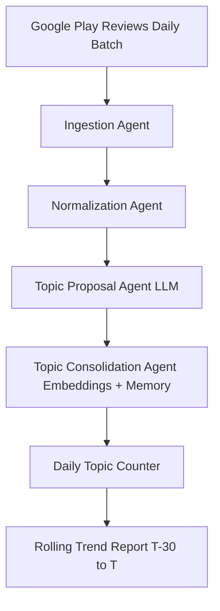

# puslegen-technologies-assignment-submission
# 🧩 Agentic Product Feedback Trend Analysis

**Google Play Store Reviews → Dynamic Topic Trends (Swiggy Case Study)**

---

## 📌 Overview

This project implements an **agentic AI pipeline** to automatically analyze Google Play Store reviews and generate rolling trend reports for product issues, requests, and feedback.

Unlike traditional topic modeling approaches (LDA, TopicBERT), this system:
- **Dynamically discovers** new evolving topics.
- **Consolidates** semantically similar feedback into clean canonical categories.
- **Maintains persistent memory** across days.
- **Produces a T to T–30 trend table** consumable by product teams.

The system is demonstrated using **Swiggy Android app reviews** from June 2024 onward.

---

## 🎯 Problem Statement

Product teams need to understand:
* What issues are trending?
* Which complaints are increasing or declining?
* What new problems are emerging over time?

**The Challenge:**
* App reviews are unstructured and noisy.
* Similar complaints are phrased differently.
* Static topic models create duplicate or incoherent topics.

This project solves these challenges using an **agentic, stateful approach**.

---

## 🧠 Agentic Design (Core Idea)

The system is *agentic by behavior*, not by tooling. It consists of multiple autonomous components (“agents”), each responsible for a cognitive task:

1.  **Review Understanding Agent**: Cleans and normalizes raw user reviews.
2.  **Topic Proposal Agent (LLM-based)**: Interprets each review and proposes 1–3 issue/request topics dynamically.
3.  **Topic Consolidation Agent (Semantic Memory)**:
    * Compares new topics with existing canonical topics using embeddings.
    * Merges semantically similar topics.
    * Creates new topics when genuinely novel issues appear.
    * Maintains long-term memory in DuckDB.
4.  **Trend Analysis Agent**: Aggregates daily topic frequencies and generates rolling trend reports.

> **Note:** Agentic behavior here is defined by reasoning, memory, and adaptability—**not by a specific library**. Orchestration frameworks like **LangGraph** are optional execution layers.

---

## 🏗️ Architecture



---

## 🗂️ Data Storage (DuckDB)

The system uses **DuckDB** as persistent memory to enable replayability and incremental learning:

| Table Name | Description |
| --- | --- |
| `reviews` | Deduplicated raw reviews |
| `topics` | Canonical topic registry |
| `topic_variants` | Surface-form variants mapped to canonicals |
| `daily_topic_counts` | Per-topic daily frequencies |

---

## 📊 Output Format

The final output is a **trend table** matching the assignment specification:

| Topic | 2024-07-11 | 2024-07-12 | 2024-07-13 | 2024-07-14 | 2024-07-15 |
| --- | --- | --- | --- | --- | --- |
| Delivery partner rude | 1 | 0 | 1 | 2 | 0 |
| Order cancellation | 0 | 0 | 1 | 1 | 1 |
| Poor customer support | 1 | 0 | 0 | 1 | 1 |

---

## ⚙️ Key Design Decisions

### Why not LDA / TopicBERT?

* Static topics.
* Poor semantic consolidation.
* High duplication and weak handling of evolving issues.

### Why embeddings + canonical registry?

* High recall without topic explosion.
* Stable trend tracking over time.
* Explicit control over merging behavior.

### Why DuckDB?

* Lightweight and embedded.
* Excellent for analytical workloads.
* Simple persistent memory for agents.

### Why limit LLM usage?

* **Cost-aware design**: LLMs used only for reasoning, not aggregation.
* System scales with *novelty*, not data volume.

---

## 🔐 Cost-Safe Development Mode

To control API usage during development:

* Review processing limits are applied.
* Only unique topic phrases are embedded.
* Non-informative reviews are skipped.
* Trend reporting is fully offline (no LLM calls).

---

## 🚀 How to Run

**1. Process daily batches**

```python
process_day("2024-07-15", limit=10)

```

**2. Backfill multiple days**

```bash
python backfill_days.py

```

**3. Generate trend report**

```bash
python test_trend_report.py

```

---

## 📌 Scope & Limitations

* Demonstrated with limited daily samples for cost control.
* Embedding caching and batching can further optimize scale.
* LangGraph orchestration can be added as a thin execution layer if needed.

## ✅ Conclusion

This project demonstrates a practical agentic AI system for product feedback analysis that learns continuously, adapts to new user issues, and produces actionable, time-aware insights.
